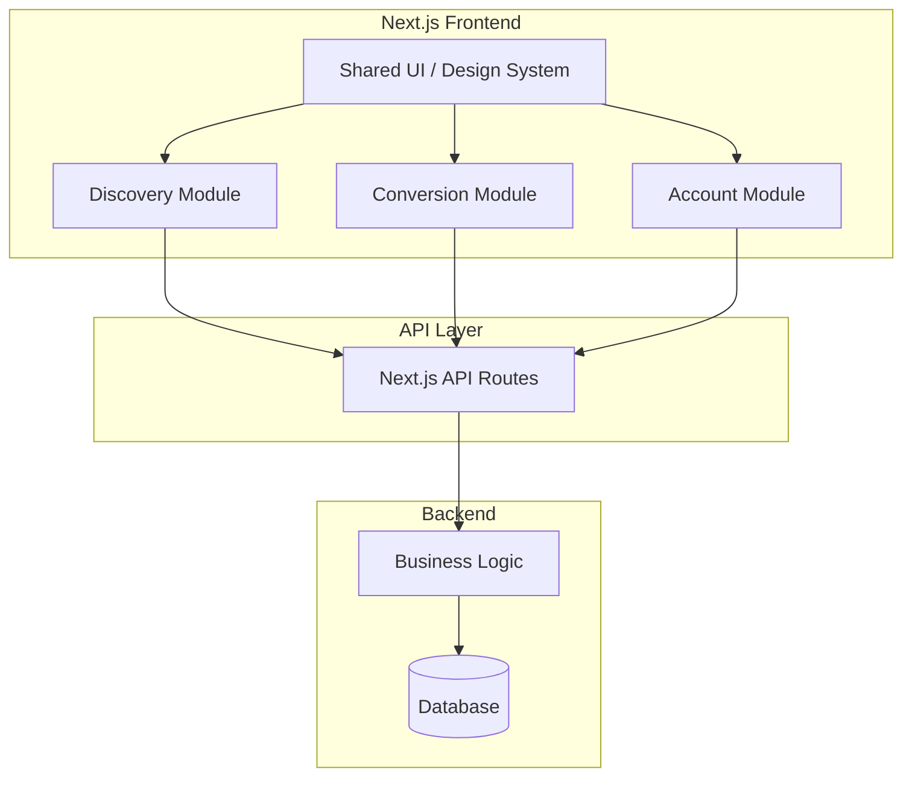
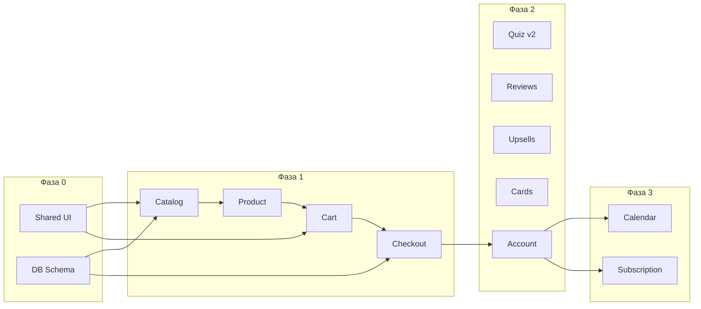

# План разработки цветочного магазина

## Архитектура проекта




---

## 1. Структура репозитория

```
shop/
├── .github/
│   └── workflows/          # CI (lint, test)
├── .husky/                 # pre-commit hooks
├── src/
│   ├── app/                # Next.js App Router
│   │   ├── (marketing)/    # Публичные страницы
│   │   ├── (shop)/         # Каталог, корзина, чекаут
│   │   ├── (account)/      # ЛК, подписка, календарь
│   │   └── api/            # API routes по фичам
│   ├── features/           # Модули по фичам
│   │   ├── catalog/        # Каталог, фильтры, букет-финдер
│   │   ├── product/        # Карточка букета, сторителлинг, отзывы
│   │   ├── cart/           # Корзина, апсейлы
│   │   ├── checkout/       # Чекаут, доставка, открытки
│   │   ├── subscription/   # Подписка на букеты
│   │   ├── occasions/      # Календарь поводов
│   │   └── account/        # Профиль, заказы
│   ├── shared/             # Общее
│   │   ├── ui/             # Кнопки, инпуты, карточки
│   │   ├── lib/            # Утилиты, клиент API
│   │   ├── hooks/          # Общие хуки
│   │   └── types/          # Общие типы
│   └── server/             # Backend-логика
│       ├── db/             # Схема, миграции, клиент
│       ├── services/       # Бизнес-логика по доменам
│       └── lib/            # Серверные утилиты
├── package.json
├── turbo.json              # Опционально: Turborepo для монорепо
└── README.md
```

Каждая фича в `features/` содержит: `components/`, `hooks/`, `api/` (или ссылки на `app/api/...`), `types.ts`.

---

## 2. Git-стратегия для двоих

### Ветки

- `main` — продакшен, только через PR
- `develop` — интеграционная ветка
- `feature/catalog-filters` — фичи (префикс по модулю)
- `fix/cart-calculation` — баги

### Workflow

1. Ветка от `develop` для каждой фичи: `feature/<module>-<name>`
2. PR в `develop` после готовности; ревью перед мержем
3. Конфликты уменьшаются за счёт разделения по папкам: `features/catalog/` vs `features/checkout/`
4. В `develop` мержить часто (минимум раз в 1–2 дня)

### Правила

- Один человек — владелец модуля: `catalog`, `product`, `cart`, `checkout`, `subscription`, `occasions`, `account`
- Общие зоны (`shared/`, `app/layout.tsx`, схема БД) — согласованные изменения через отдельные PR
- Перед стартом фичи — синхронизация с `develop`

---

## 3. Разделение модулей между разработчиками


| Модуль                     | Ответственный                                                        | Фичи                                                                            |
| -------------------------- | -------------------------------------------------------------------- | ------------------------------------------------------------------------------- |
| **Discovery** (человек A)  | `features/catalog/`, `features/product/`                             | Каталог, фильтры, букет-финдер, карточка букета, сторителлинг, отзывы и галерея |
| **Conversion** (человек B) | `features/cart/`, `features/checkout/`                               | Корзина, апсейлы, чекаут, слоты доставки, редактор открыток                     |
| **Account** (человек B)    | `features/account/`, `features/occasions/`, `features/subscription/` | ЛК, календарь поводов, подписка на букеты                                       |


Общее: `shared/`, `server/db/`, `server/services/` (по договорённости).

---

## 4. Фазы разработки

### Фаза 0: Фундамент (вместе, 3–5 дней)

- Инициализация Next.js 16 (App Router, Turbopack по умолчанию), Tailwind, ESLint, Prettier
- Требования: Node.js 20.9+, TypeScript 5.1+
- Базовая схема БД (PostgreSQL + Prisma/Drizzle): `bouquets`, `categories`, `users`, `orders`
- Shared UI: кнопки, инпуты, карточки, layout
- Структура `features/` и базовые типы
- Git: `develop`, первый коммит структуры

### Фаза 1: MVP (параллельно, ~2 недели)

**Человек A**

- Каталог букетов (список, фильтры по цвету/цене/настроению)
- Карточка букета (фото, описание, состав)
- Базовый букет-финдер (квиз: повод → рекомендации)

**Человек B**

- Корзина (добавление, изменение количества)
- Чекаут: форма заказа, выбор даты/времени доставки
- Базовый backend: создание заказа, слоты доставки

**Интеграция:** каталог → корзина → чекаут → заказ.

### Фаза 2: Улучшения (параллельно, ~2 недели)

**Человек A**

- Микро-сторителлинг к букетам
- Отзывы и галерея с фото
- Доработка букет-финдера (бюджет, предпочтения)

**Человек B**

- Апсейлы в корзине («часто покупают вместе»)
- Редактор открыток (шаблоны, текст)
- Личный кабинет: профиль, история заказов

### Фаза 3: Продвинутые фичи (параллельно, ~2 недели)

**Человек A**

- 3D/AR превью букета (Three.js, по желанию)
- Анимации и полировка UI
- Локализация (i18n)

**Человек B**

- Календарь поводов и напоминания
- Подписка на букеты
- Уведомления (email о заказе, напоминания)

### Фаза 4: Финализация

- Тестирование, оптимизация
- SEO, метрики, аналитика
- Деплой

---

## 5. Зависимости между модулями




---

## 6. Конвенции кода

- **Именование:** `kebab-case` для папок, `PascalCase` для компонентов
- **Импорты:** через `@/features/...`, `@/shared/...`, `@/server/...`
- **Типы:** в `types.ts` внутри фичи или в `shared/types`
- **API:** `/api/v1/<module>/<action>` (например, `/api/v1/bouquets`, `/api/v1/orders`)
- **Линтеры:** ESLint + Prettier, pre-commit через Husky
- **Коммиты:** Conventional Commits (`feat:`, `fix:`, `refactor:`)

---

## 7. Схема БД (основные сущности)

- `User` — id, email, name, preferences
- `Bouquet` — id, name, description, price, images, composition, story, categoryId
- `Category` — id, name, slug
- `Order` — id, userId, status, deliverySlot, total, createdAt
- `OrderItem` — orderId, bouquetId, quantity, cardText, addons
- `Review` — id, bouquetId, userId, rating, text, photos
- `Occasion` — id, userId, date, type, recipientName, reminderSent
- `Subscription` — id, userId, bouquetId, frequency, nextDelivery, status

---

## 8. Риски и смягчение


| Риск                  | Решение                                                       |
| --------------------- | ------------------------------------------------------------- |
| Конфликты в `shared/` | Закрепить ownership за компонентами, крупные правки обсуждать |
| Расхождения в API     | Описать OpenAPI/типы в `shared/types/api.ts` до реализации    |
| Разные стили кода     | Prettier + ESLint в CI, единый `pre-commit`                   |
| Дублирование логики   | Выносить общее в `shared/lib/` и `server/services/`           |


---

## Итог

План позволяет двоим разрабатывать фичи параллельно при минимальных пересечениях. Структура по `features/` и чёткое разделение модулей между людьми снижают конфликты в Git. Фазы можно корректировать под реальный темп работы.